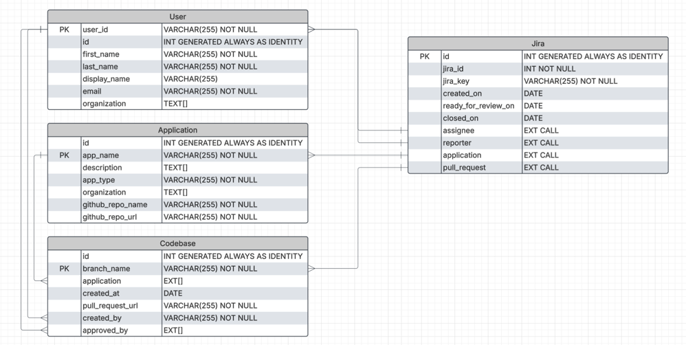

# Project Tracker

The Project Tracker is a web application designed to help users manage and track their Jira Work IDs efficiently. It provides
features for creating, updating, and deleting projects, as well as assigning tasks to team members. The application
leverages Spring Boot for the backend, JPA for database interactions, and Maven for project management.

## Features
* User management with unique user IDs and email addresses.
* Project and task management with assignment capabilities.
* Integration with Jira for issue tracking.
* RESTful APIs for interacting with the application.

# Database Model
The database model for the Project Tracker application consists of the following entities:
